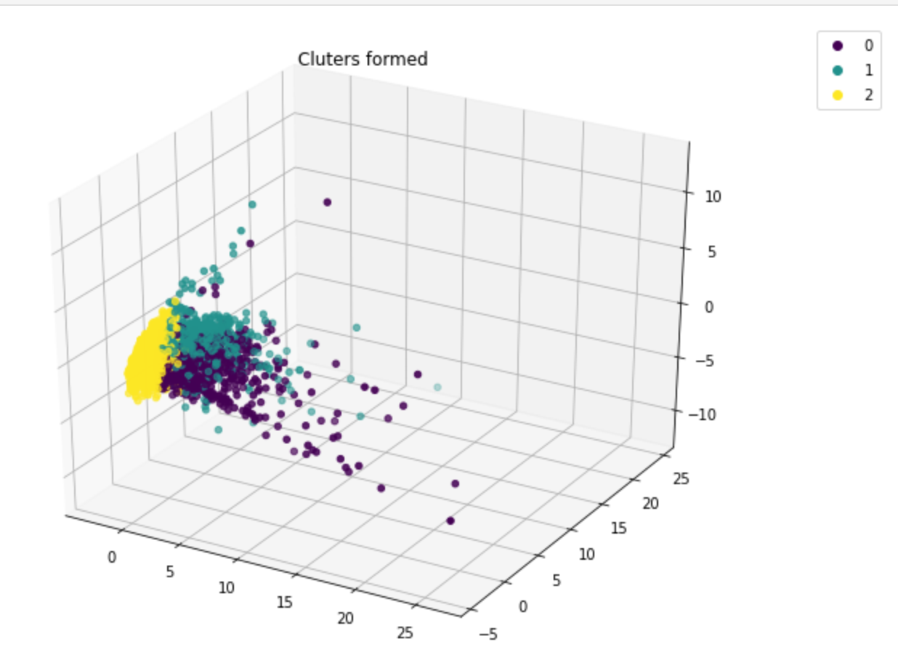
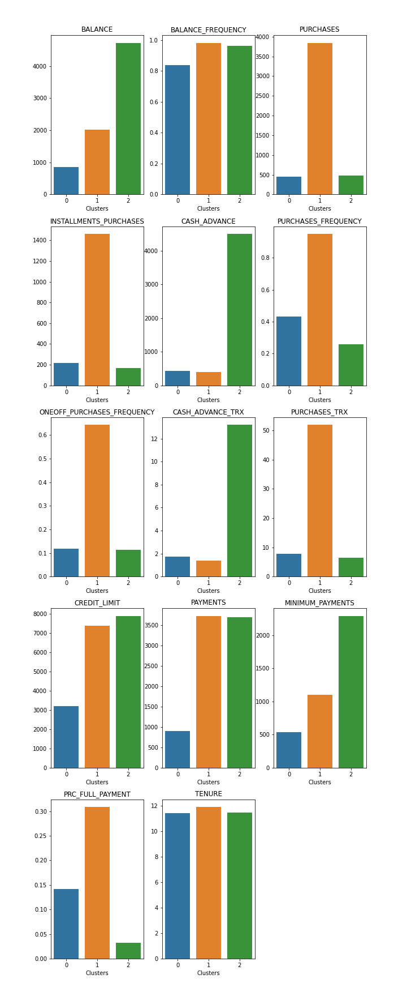

# Credit Card Customer Segmentation

In this project, the objective is to segment credit card customers into different groups.

## Dataset
https://www.kaggle.com/datasets/arjunbhasin2013/ccdata

###  Data Dictionary
* CUSTID : Identification of Credit Card holder (Categorical)
* BALANCE : Balance amount left in their account to make purchases (
* BALANCEFREQUENCY : How frequently the Balance is updated, score between 0 and 1 (1 = frequently updated, 0 = not frequently updated)
* PURCHASES : Amount of purchases made from account
* ONEOFFPURCHASES : Maximum purchase amount done in one-go
* INSTALLMENTSPURCHASES : Amount of purchase done in installment
* CASHADVANCE : Cash in advance given by the user
* PURCHASESFREQUENCY : How frequently the Purchases are being made, score between 0 and 1 (1 = frequently purchased, 0 = not frequently purchased)
* ONEOFFPURCHASESFREQUENCY : How frequently Purchases are happening in one-go (1 = frequently purchased, 0 = not frequently purchased)
* PURCHASESINSTALLMENTSFREQUENCY : How frequently purchases in installments are being done (1 = frequently done, 0 = not frequently done)
* CASHADVANCEFREQUENCY : How frequently the cash in advance being paid
* CASHADVANCETRX : Number of Transactions made with "Cash in Advanced"
* PURCHASESTRX : Numbe of purchase transactions made
* CREDITLIMIT : Limit of Credit Card for user
* PAYMENTS : Amount of Payment done by user
* MINIMUM_PAYMENTS : Minimum amount of payments made by user
* PRCFULLPAYMENT : Percent of full payment paid by user
* TENURE : Tenure of credit card service for user

## Structure
* Data Exploration
* Normalization
* Principal Component Analysis 
* K-means Clustering

## Results

### Clusters Formed

### Purchase Behaviour

### Customer Segments

* Group-1: Poor & Inert  
  This type of customers have less balance and less purchases. They only buy the necessities and don't take cash advance and installments to do so.

* Group-2: Cream Customers  
  This type of customers do a lot of purchases. Take minimal cash advance to do purchases. They even have a good balance and can afford their buy.
  
* Group-3: Rich but Purchase less  
This type of customers are rich people with a good amount of balance but not frequent buyers. Even with a lot of balance they still take a lot of cash advance to purchase suggesting that they buy expensive items.

## Deployed Website Link
https://cc-customer-segmentation.herokuapp.com/

